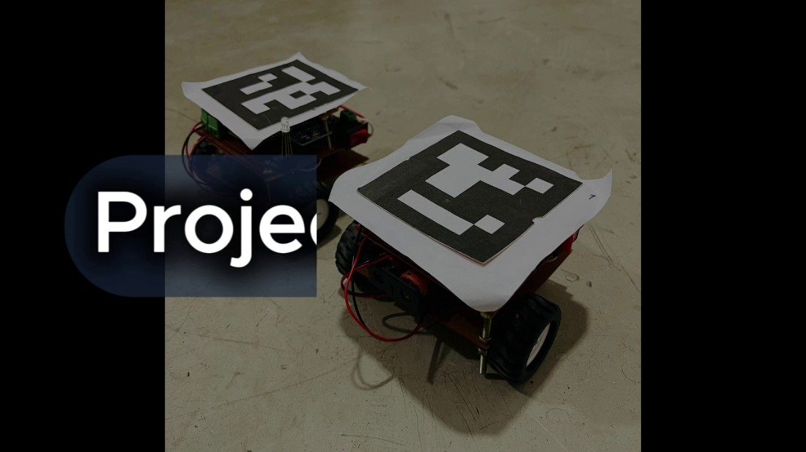
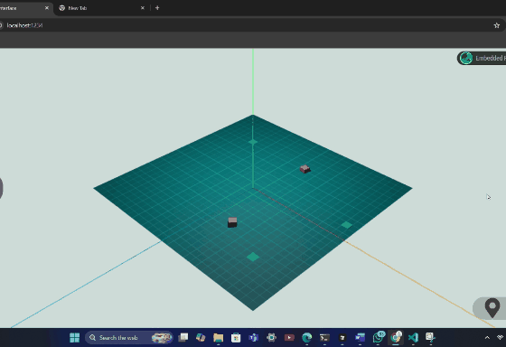
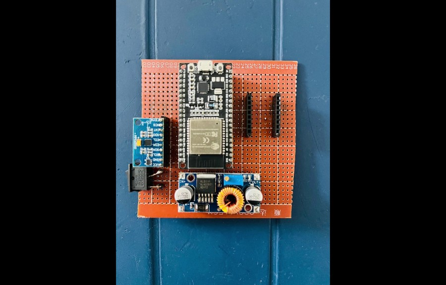
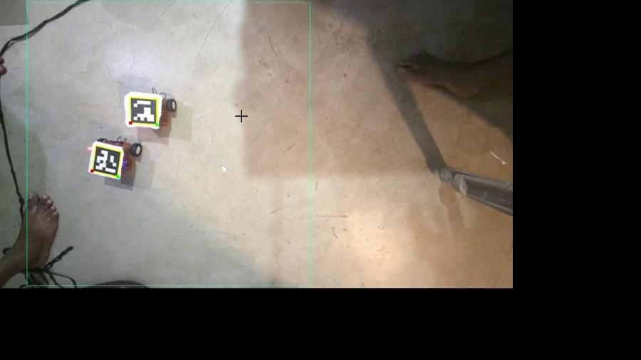
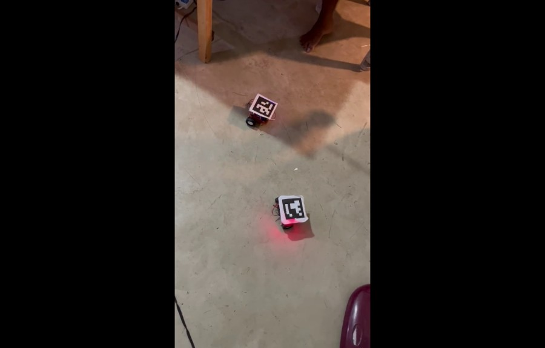
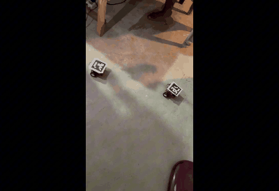
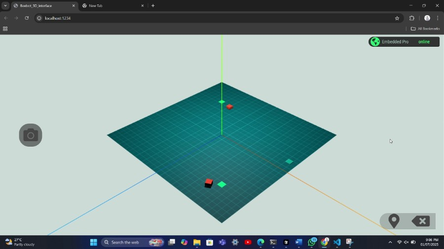

<div align="center">



# Project Beebot
### Autonomous Multi-Robot Swarm Navigation — No LiDAR, No IMU on the Field


</div>

---

## Overview

Project Beebot is a cost-effective autonomous multi-robot navigation system for structured indoor environments (warehouses, labs). Two differential-drive robots are guided entirely by an **overhead camera** — no LiDAR, no on-robot positioning sensors. A platform PC detects each robot via **ArUco markers**, computes movement commands with a **potential-field algorithm**, and sends them over **Wi-Fi TCP sockets**. A **3D web interface** built with Three.js lets an operator click a destination and watch the robots move in real time.

<div align="center">

| ArUco Detection & Tracking | Live 3D Interface |
|:-:|:-:|
|  |  |

</div>

---

## Features

- **Overhead-camera localisation** — ArUco fiducial markers replace LiDAR and IMU-based positioning entirely
- **Potential-field path planning** — attraction toward destination, repulsion between robots for implicit collision avoidance
- **Kalman filter** smooths position estimates when a marker is briefly occluded
- **PID-controlled turning** using the onboard MPU6500 gyroscope for accurate heading correction
- **Real-time 3D visualisation** — Three.js arena mirrors the physical floor; set destinations by clicking in 3D space
- **MQTT coordination** — platform PC and browser communicate through a public broker (zero extra infrastructure)
- **Flask camera feed** — live stream available at `localhost:3001` for debugging

---

## System Architecture

```
┌─────────────────────────────────────────────────────────────────────────┐
│                            PLATFORM PC                                   │
│                                                                          │
│  ┌───────────────┐   ┌──────────────────┐   ┌───────────────────────┐  │
│  │ Overhead Cam  │──▶│ ArUco Detection  │──▶│  Kalman Filter        │  │
│  │ (Iriun/USB)   │   │  (OpenCV 4.x)    │   │  (position smoothing) │  │
│  └───────────────┘   └──────────────────┘   └───────────┬───────────┘  │
│                                                          │               │
│                       ┌──────────────────────────────────▼────────────┐ │
│                       │  Potential Field Navigation                    │ │
│                       │  field.py · movements.py · resaltant.py        │ │
│                       │  → resultant force angle + magnitude           │ │
│                       └──────────────────────────────────┬────────────┘ │
│                                                          │               │
│   ┌─────────────────────┐      ┌───────────────────────▼─────────────┐ │
│   │  Flask  :3001        │     │  positioning_algo.py                 │ │
│   │  /video_feed        │     │  → (start_angle, distance, end_angle) │ │
│   │  /home  /start      │     └───────────────────────┬──────────────┘ │
│   └─────────────────────┘                             │  TCP socket     │
└───────────────────────────────────────────────────────┼─────────────────┘
                                                         │ Wi-Fi  :8080
               ┌─────────────────────────────────────────┼──────────────┐
               │ MQTT  test.mosquitto.org                 │              │
               │  swarm/0/bot_pos  (protobuf positions)  │              │
               │  swarm/0/com      (commands)            │              │
               └──────────────────┬──────────────────────┼──────────────┘
                                  │ WebSocket             │ TCP
               ┌───────────────────▼──────┐   ┌──────────▼────────────┐
               │  3D Interface            │   │  ESP32 (BeeBot)        │
               │  interface/  :1234       │   │  firmware/src/main.cpp │
               │  Three.js + TWEEN.js     │   │  MPU6500 gyroscope     │
               │  Click to set destination│   │  TB6612FNG motors      │
               │  Protobuf deserialization│   │  PID turn control      │
               └──────────────────────────┘   │  RGB LED status        │
                                              └───────────────────────┘
```

---

## Hardware

### Robot Electronics

Each BeeBot carries a custom control board built on a perf board:

| Component | Role |
|---|---|
| **ESP32 WROOM-32** | MCU — Wi-Fi, TCP server, motor PWM, PID loop |
| **MPU6500** | Gyroscope — Z-axis heading correction during turns |
| **TB6612FNG** | Dual DC motor driver |
| **XL4005 Buck Converter** | Steps battery voltage down to 3.3 V |
| **RGB LED** | Status: Blue = connected · Green = moving · Red = idle |
| **N18 DC gear motors** | Left + right differential drive |

<div align="center">

| Rev 1 — NodeMCU form factor | &nbsp; |
|:-:|:-:|
| Schematic | PCB layout |
|  |  |

| Rev 2 — ESP32 DevKit V1 | &nbsp; |
|:-:|:-:|
| Schematic | PCB layout |
|  |  |


<br/><em>Assembled Rev 1 prototype on perf board</em>

</div>

### ArUco Markers

Print the files in `assets/markers/` at roughly **12 × 12 cm** and mount one on each robot's top face. The system uses the `DICT_6X6_250` ArUco dictionary.

| File | Robot |
|---|---|
| `assets/markers/marker1.png` | Bot 0 |
| `assets/markers/marker2.png` | Bot 1 |
| `assets/markers/marker3.png` | Reference / destination |

---

## How It Works

### 1 · Overhead Camera Localisation

A phone camera mounted above the arena (connected via Iriun Webcam) streams to the platform PC. OpenCV detects ArUco markers each frame, extracting centre point and heading from corner coordinates. A Kalman filter (`platform_pc/Main_Code/kalman.py`) smooths estimates when a marker is occluded.

<div align="center">

<br/><em>Overhead view — green ROI boundary, yellow marker bounding boxes, heading arrows</em>
</div>

### 2 · Potential Field Navigation

`platform_pc/Main_Code/field.py` models the arena as an electromagnetic field:

- **Attraction** to destination — force ∝ distance² (robot pulls toward goal)
- **Repulsion** between robots — force ∝ 1 / distance⁵ (sharp short-range push-away)

`resaltant.py` sums all force vectors and returns the resultant magnitude and direction. This direction becomes the target heading for the next move.

### 3 · Robot Command Protocol

`positioning_algo.py` converts (current position, heading, target position) into three floats:

```
<id>,<start_turn_rad>,<travel_dist>,<end_turn_rad>\n
```

Sent over TCP socket to the ESP32 on port **8080**. The robot replies `OK\r\n` or `ERROR\r\n`.

### 4 · ESP32 Motor Control

1. Parse the command tuple from the TCP socket
2. PID on MPU6500 Z-axis to execute the turn (exits when angle < ±0.25 rad threshold)
3. Drive forward for the calculated distance steps
4. RGB LED reflects current state throughout

<div align="center">

<br/><em>Two BeeBots navigating — RGB status LEDs visible</em>
</div>

<div align="center">

<br/><em>Autonomous navigation to assigned destinations</em>
</div>

### 5 · MQTT + 3D Visualisation

After each camera frame the platform PC serialises robot positions as **Protocol Buffers** (`BotPositionArr`) and publishes to `swarm/0/bot_pos` on `test.mosquitto.org`. The 3D interface subscribes via WebSocket, deserialises, and animates STL robot models using TWEEN.js inside a Three.js scene.

<div align="center">

<br/><em>3D interface — red cubes are robots, green diamonds are destinations, top-right shows "online"</em>
</div>

---

## Repository Structure

```
PROJECT-BEEBOT/
│
├── firmware/                        # ESP32 firmware (PlatformIO)
│   ├── platformio.ini
│   └── src/
│       └── main.cpp                 # Wi-Fi, TCP server, PID, gyro, motors
│
├── platform_pc/                     # Platform PC server (Python 3)
│   ├── Main_Code/                   # Main application (run from this directory)
│   │   ├── mainProg.py              # ← Entry point
│   │   ├── config.py                # ROI pixel coordinates
│   │   ├── field.py                 # Potential field force calculation
│   │   ├── movements.py             # Per-robot resultant wrapper
│   │   ├── resaltant.py             # Vector resultant (force addition)
│   │   ├── positioning_algo.py      # Position → (turn, dist, turn) angles
│   │   ├── kalman.py                # Kalman filter for position smoothing
│   │   ├── robot.py                 # Robot data class
│   │   ├── roboArrangement.py       # Bot-to-destination assignment
│   │   ├── flaskServing.py          # Flask camera feed + homing endpoints
│   │   ├── socketCom.py             # TCP socket to ESP32
│   │   ├── helpFunc.py              # Helper utilities
│   │   ├── encrypt.py               # AES encryption helper
│   │   ├── MQTT_msg_pb2.py          # Generated protobuf bindings
│   │   ├── roi_calibration.py       # Interactive ROI calibration tool
│   │   ├── templates/               # Flask HTML/JS/CSS templates
│   │   └── requirements.txt
│   │
│   └── tools/                       # Standalone utilities
│       ├── detect_AR_maker/
│       │   └── detect.py            # Quick ArUco detection test
│       └── generate_marker/
│           └── generate_maker.py    # ArUco marker image generator
│
├── interface/                       # 3D web control panel (Node.js)
│   ├── index.html
│   ├── app.js                       # Three.js scene, animation, mouse events
│   ├── mqttClient.js                # MQTT WebSocket client + protobuf decode
│   ├── servers.js                   # MQTT server discovery
│   ├── Item.js                      # Bot / destination object model
│   ├── screenLables.js              # On-screen labels above bots
│   ├── config.js                    # Arena dimensions
│   ├── encrypt.js                   # AES encryption helper
│   ├── package.json
│   ├── protobuf/
│   │   ├── MQTT_msg.proto           # Protobuf schema
│   │   └── MQTT_msg_pb.js           # Compiled JS bindings
│   └── resources/
│       ├── 3DModels/                # STL models (robot body)
│       └── images/                  # Arena texture maps
│
├── docs/
│   ├── hardware/                    # PCB designs & schematics (EasyEDA)
│   │   ├── Beebot 1 Schematic.png
│   │   ├── Beebot 1 PCB.png
│   │   ├── Beebot 2 Schematic.png
│   │   └── Beebot 2 PCB.png
│   ├── images/                      # README screenshots & GIFs
│   ├── Project_proposal.pdf
│   └── Project-Beebot-Progress.pptx
│
├── assets/
│   └── markers/                     # Printable ArUco marker sheets
│       ├── marker1.png              # Bot 0
│       ├── marker2.png              # Bot 1
│       └── marker3.png              # Reference
│
├── .gitignore
└── README.md
```

---

## Quick Start — Clone and Run

### Prerequisites

| Tool | Version | Notes |
|---|---|---|
| Python | 3.9 + | |
| Node.js | 18 + | |
| PlatformIO | latest | VS Code extension **or** `pip install platformio` |
| Iriun Webcam | any | Phone → virtual USB cam; any webcam works as fallback |

---

### Step 1 — Flash ESP32 Firmware

1. Open `firmware/` as a PlatformIO project in VS Code.

2. Edit `firmware/src/main.cpp` — update Wi-Fi credentials and set a unique ID per robot:

```cpp
const char* ssid     = "YOUR_WIFI_SSID";
const char* password = "YOUR_WIFI_PASSWORD";

String myID = "1";   // → "2" for the second robot
```

3. Build and upload:

```bash
pio run --target upload --project-dir firmware
```

4. Open Serial Monitor at **115200 baud** and note the IP address printed on boot — you need it for Step 2.

---

### Step 2 — Platform PC Server

```bash
cd platform_pc/Main_Code
pip install -r requirements.txt
```

**One-time ROI calibration** (drag the green rectangle to frame the arena floor area):

```bash
python roi_calibration.py
```

**Set robot IP addresses** in `socketCom.py`:

```python
ROBOT_IPS = {
    "1": "192.168.x.x",   # from Serial Monitor — Bot 1
    "2": "192.168.x.x",   # from Serial Monitor — Bot 2
}
```

**Start the server:**

```bash
python mainProg.py
```

This opens:
- OpenCV window with camera feed + detection overlays (press **Q** to quit)
- Flask server at `http://localhost:3001` — camera stream + `/home` homing endpoint
- MQTT connection to `test.mosquitto.org:1883`

---

### Step 3 — 3D Interface

```bash
cd interface
npm install
npm start
```

Open **`http://localhost:1234`** in your browser.

Once the platform PC is running, the status badge in the top-right will turn **online**.

| Control | Action |
|---|---|
| **Map-pin icon** | Enter destination-setting mode |
| **Click on arena** | Place a destination for the next idle robot |
| **Map-pin icon again** | Send all destinations — robots start moving |
| **Trash icon** | Clear all destinations |
| **Camera icons** | Reset view / top-down view |

<div align="center">

</div>

---

### Optional Tools

**Test ArUco detection standalone:**

```bash
# edit detect.py to set your camera URL or index first
python platform_pc/tools/detect_AR_maker/detect.py
```

**Generate new marker images:**

```bash
python platform_pc/tools/generate_marker/generate_maker.py
```

---

## Configuration Reference

| File | Variable | Default | Description |
|---|---|---|---|
| `platform_pc/Main_Code/config.py` | `ROI` | `{start_x:175, start_y:130, end_x:1100, end_y:825}` | Camera region of interest (px) |
| `platform_pc/Main_Code/mainProg.py` | `BOT_COUNT` | `2` | Number of robots |
| `platform_pc/Main_Code/mainProg.py` | `SWARM_ID` | `0` | MQTT topic namespace |
| `platform_pc/Main_Code/mainProg.py` | `MQTT_BROKER` | `test.mosquitto.org` | Broker hostname |
| `platform_pc/Main_Code/mainProg.py` | `kalmanEn` | `True` | Enable Kalman smoothing |
| `platform_pc/Main_Code/mainProg.py` | `flaskEn` | `True` | Enable Flask camera server |
| `interface/config.js` | `AREANA_DIM` | `30` | Logical arena size (world units) |
| `firmware/src/main.cpp` | `turningThresh` | `0.25 rad` | Min angle before a turn executes |
| `firmware/src/main.cpp` | `distThresh` | `20 px` | Pixel distance considered "arrived" |
| `firmware/src/main.cpp` | `spd` | `-100` | Base motor speed (−255 … 255) |

---

## Results

**What was achieved:**

- Reliable ArUco detection at **30 fps** over a 1280 × 960 px overhead feed
- Two robots simultaneously tracked and commanded with no cross-talk
- Destination reached with **< 40 px residual error** (≈ 3 cm at test scale)
- Collision avoidance emerged naturally from the repulsive field — no explicit planner needed
- Kalman filter maintained stable estimates through brief marker occlusions
- Full round-trip latency (camera → MQTT → 3D UI update) under **500 ms**

---

## Conclusions

Beebot shows that a single overhead camera with ArUco markers can replace expensive per-robot sensors for structured indoor navigation. The potential-field planner is reactive and scales to more robots without algorithmic redesign.

**Key takeaways:**

1. Centralised vision outperforms distributed sensing at small scale — one high camera covers the whole arena cheaply.
2. Potential fields give implicit collision avoidance, but can trap robots in local minima at symmetric configurations.
3. The Kalman filter is essential — without it, single-frame detection noise causes erratic motor commands.
4. MQTT + Protobuf is a practical real-time coordination layer; the public broker was sufficient for demonstration.

**Future directions:**

- Fabricate the custom PCB (designs in `docs/hardware/`)
- Add dynamic obstacle avoidance for objects not tracked by the system
- Scale to 4+ robots and handle potential-field local-minima escape
- Enable the AES payload encryption already implemented in `platform_pc/Main_Code/encrypt.py` and `interface/encrypt.js`
- Move to a private MQTT broker for production use

---

<div align="center">
<sub>Built as an embedded systems group project · PCB designed with EasyEDA</sub>
</div>
